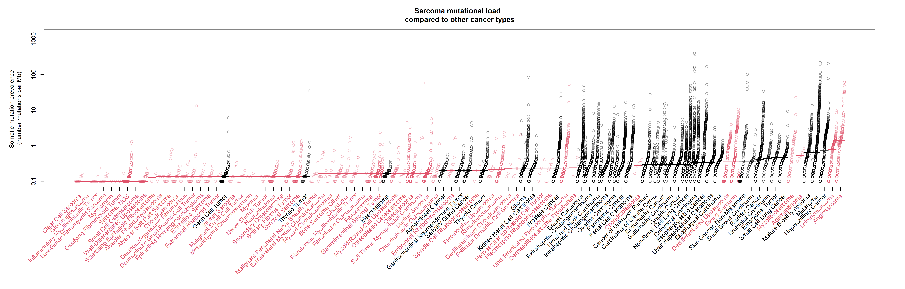

# Sarcoma facts

## Aim
This repository collects evidences from sarcoma publications and publish them here. 

## Sarcoma in general

### Epidemiology
Here some graphication of the paper from [de Pinieux 2021](https://pubmed.ncbi.nlm.nih.gov/33630918/). The paper reports the number of cases gathered by the French nationwide networks of reference centers for sarcomas (RREPS/NETSARC/RESOS) that collects and reviews all national cases of sarcomas and connective tumors of intermediate malignancy.

This first graph shows the total number of cases by differentiation (i.e. the chapters of the WHO classifications)

Whereas this second graph shows the total number of cases by histology. 

And this is the same graph using a wordcloud instead. 

### Mutational staus
Although results from [TCGA](https://pubmed.ncbi.nlm.nih.gov/29100075/) suggested that sarcoma tended to have few mutations and more copy number variation, more recent genomic data seems to suggest that the number of mutation depends the sarcoma histotype. 

